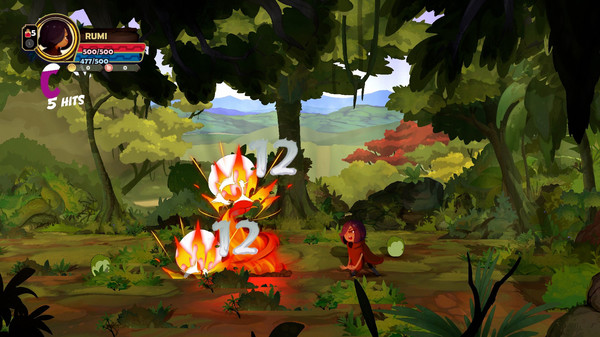
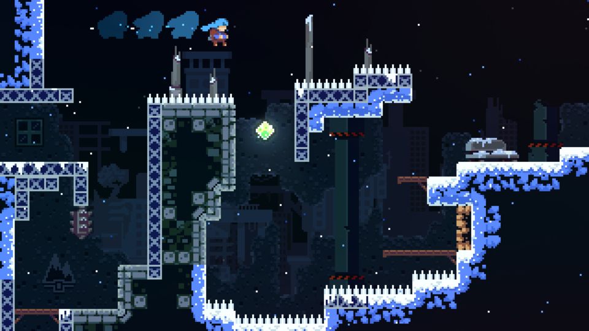
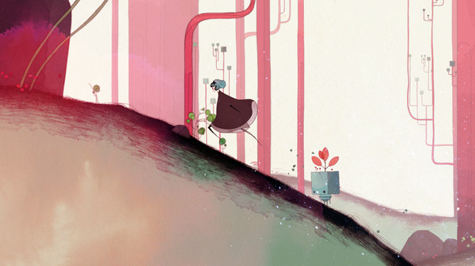

# Introducció i motivació

En aquest taller anem a crear una startup enfocada al desenvolupament de videojocs i dissenyar el nostre primer projecte per presentar-lo davant un grup d'inversors, amb l'objectiu de convèncer-los perquè financien el projecte.

## Quin és l'estat del sector del videojoc a l'estat espanyol?

{ type=application/pdf style="min-height:50vh;width:100%"  }

* Document: [La industria del videojuego en España en 2023. Anuari de l'AEVI](https://www.aevi.org.es/web/wp-content/uploads/2024/05/AEVI_Anuario-2023-2.pdf)

#### La propaganda, l'estudiant i el desenvolupador indie

<iframe width="640" height="480" src="https://www.youtube.com/embed/Qp0eWqgO0ow" title="La industria del videojuego en España" frameborder="0" allow="accelerometer; autoplay; clipboard-write; encrypted-media; gyroscope; picture-in-picture; web-share" referrerpolicy="strict-origin-when-cross-origin" allowfullscreen></iframe>

<iframe width="640" height="480" src="https://www.youtube.com/embed/_Dvek1DEg5A" title="¿Cuál es el estado de la industria de videojuegos en España? - SocraTech" frameborder="0" allow="accelerometer; autoplay; clipboard-write; encrypted-media; gyroscope; picture-in-picture; web-share" referrerpolicy="strict-origin-when-cross-origin" allowfullscreen></iframe>

<iframe width="640" height="480" src="https://www.youtube.com/embed/xe0xPxeWj58" title="¿Cómo es la industria de videojuegos en España?
" frameborder="0" allow="accelerometer; autoplay; clipboard-write; encrypted-media; gyroscope; picture-in-picture; web-share" referrerpolicy="strict-origin-when-cross-origin" allowfullscreen></iframe>

## Alguns videojocs independents d'èxit

### **[Stardew Valley (2016)](https://store.steampowered.com/app/413150/Stardew_Valley/)** 

- **Desenvolupador:** ConcernedApe (una sola persona!)
- **Estil:** Gestió de granja, simulador de vida, pixel art
- **Èxit:** Més de 20 milions de còpies venudes. Comunitat molt activa amb mods i expansions.

### **[Tunche (2021)](https://store.epicgames.com/es-ES/p/tunche)**

- **Desenvolupador:** LEAP Game Studios (Perú)
- **Estil:** Beat 'em up amb estil artístic dibuixat a mà
- **Èxit:** Celebrat per la seua connexió amb el folklore amazònic i el seu art visual.

### **[Hollow Knight (2017)](https://store.steampowered.com/app/367520/Hollow_Knight/?l=spanish)**

- **Desenvolupador:** Team Cherry (Austràlia)
- **Estil:** Metroidvania, acció i exploració
- **Èxit:** Més de 5 milions de còpies venudes. Cult-hit que espera la seqüela *Silksong*.

### **[Celeste (2018)](https://store.steampowered.com/app/504230/Celeste/?l=spanish)**

- **Desenvolupador:** Matt Makes Games
- **Any:** 
- **Estil:** Plataformes de precisió amb història emocional
- **Èxit:** Premiat com a millor joc independent als The Game Awards 2018. Aclamació crítica.

### **[Gris (2018)](https://store.steampowered.com/app/683320/GRIS/?l=spanish)**

- **Desenvolupador:** Nomada Studio (Barcelona)
- **Estil:** Plataformes artístic i narratiu
- **Èxit:** Més d’1 milió de còpies venudes. Aclamació visual i musical.

El proper videojoc indie d'exit... el vostre!